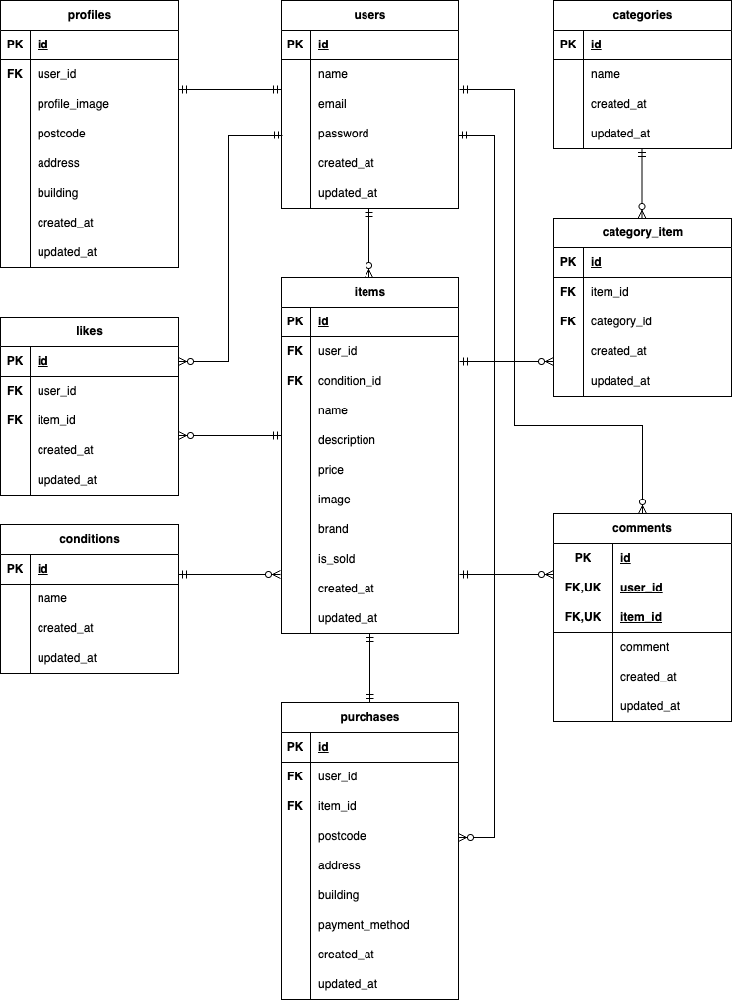

# flea-market（新模擬案件\_フリマアプリ）

## 環境構築

**Dockerビルド**

1. `git clone git@github.com:yuyu580905-dev/flea-market.git`
2. DockerDesktopアプリを立ち上げる
3. `cd flea-market/`
4. `docker-compose up -d --build`

**Laravel環境構築**

1. `docker-compose exec php bash`
2. `composer install`
3. .env.example をコピーして .env を作成

```bash
cp .env.example .env
```

4. .envに以下の環境変数を設定

```env
DB_CONNECTION=mysql
DB_HOST=mysql
DB_PORT=3306
DB_DATABASE=laravel_db
DB_USERNAME=laravel_user
DB_PASSWORD=laravel_pass

MAIL_MAILER=smtp
MAIL_HOST=sandbox.smtp.mailtrap.io
MAIL_PORT=2525
MAIL_USERNAME=your_mailtrap_username
MAIL_PASSWORD=your_mailtrap_password
MAIL_ENCRYPTION=tls
MAIL_FROM_ADDRESS=test@example.com
MAIL_FROM_NAME="${APP_NAME}"

STRIPE_KEY=your_stripe_publishable_key
STRIPE_SECRET=your_stripe_secret_key
```

5. アプリケーションキーの作成

```bash
php artisan key:generate
```

6. マイグレーションの実行

```bash
php artisan migrate
```

7. storageディレクトリ公開

```bash
php artisan storage:link
```

8. シーディングの実行

```bash
php artisan db:seed
```

## メール認証・Stripe設定について

本アプリではメール認証にMailtrap、決済機能にStripeを使用しています

### Mailtrap設定

1. Mailtrapに登録
2. Sandboxを作成
3. SMTP情報を取得
4. .envへ以下を設定

```env
MAIL_MAILER=smtp
MAIL_HOST=sandbox.smtp.mailtrap.io
MAIL_PORT=2525
MAIL_USERNAME=your_mailtrap_username
MAIL_PASSWORD=your_mailtrap_password
MAIL_ENCRYPTION=tls
MAIL_FROM_ADDRESS=test@example.com
MAIL_FROM_NAME="${APP_NAME}"
```

設定後、以下を実行してください

```bash
php artisan config:clear
```

### Stripe設定

商品購入機能を利用する場合は、StripeのテストAPIキーを設定してください

1. Stripeアカウントを作成
2. 開発者ダッシュボードからテスト用APIキーを取得
3. .envへ以下を設定

```env
STRIPE_KEY=pk_test_xxxxxxxxxxxxxxxxxxxxx
STRIPE_SECRET=sk_test_xxxxxxxxxxxxxxxxxxxxx
```

設定後、以下を実行してください

```bash
php artisan config:clear
```

※ StripeのAPIキーが未設定の場合、購入処理実行時に認証エラーが発生します

## テスト

PHPUnitを使用して以下の機能テストを実装しています

- 会員登録
- メール認証機能
- ログイン
- ログアウト
- 商品一覧取得
- マイリスト一覧取得
- 商品検索
- 商品詳細取得
- いいね機能
- コメント機能
- 商品購入
- 支払方法選択
- 配送先変更
- ユーザー情報取得
- ユーザー情報変更
- 商品出品情報登録

## PHPUnit テスト実行

本アプリではテスト実行時に `demo_test` データベースを使用します

### 1. テスト用データベース作成

MySQLコンテナへ接続し、テスト用データベースを作成

```sql
CREATE DATABASE demo_test;
```

### 2. database.php にテスト用接続を追加

`config/database.php` の `connections` 配列内で、既存の `mysql` 接続をコピーし、その直下に `mysql_test` 接続を追加してください  
配列の中の`'database'` `'username'` `'password'` を以下の内容へ変更します

```php
'mysql_test' => [
            'driver' => 'mysql',
            'url' => env('DATABASE_URL'),
            'host' => env('DB_HOST', '127.0.0.1'),
            'port' => env('DB_PORT', '3306'),
            'database' => 'demo_test',
            'username' => 'root',
            'password' => 'root',
            'unix_socket' => env('DB_SOCKET', ''),
            'charset' => 'utf8mb4',
            'collation' => 'utf8mb4_unicode_ci',
            'prefix' => '',
            'prefix_indexes' => true,
            'strict' => true,
            'engine' => null,
            'options' => extension_loaded('pdo_mysql') ? array_filter([
                PDO::MYSQL_ATTR_SSL_CA => env('MYSQL_ATTR_SSL_CA'),
            ]) : [],
        ],
```

### 3. .env.testing を作成

PHPコンテナへ接続し、`.env` をコピーして `.env.testing` を作成

```bash
cp .env .env.testing
```

.env.testingを以下の内容へ変更

```env
APP_NAME=Laravel
APP_ENV=test
APP_KEY=
APP_DEBUG=true
APP_URL=http://localhost

DB_CONNECTION=mysql_test
DB_HOST=mysql
DB_PORT=3306
DB_DATABASE=demo_test
DB_USERNAME=root
DB_PASSWORD=root
```

### 4. テスト用アプリケーションキー生成

```bash
php artisan key:generate --env=testing
```

### 5. キャッシュの削除

```bash
php artisan config:clear
```

### 6. マイグレーションを実行してテスト用のテーブルを作成

```bash
php artisan migrate --env=testing
```

### 7. phpunit.xml の編集

プロジェクトの直下の `phpunit.xml` を開き、`DB_CONNECTION` と `DB_DATABASE` を以下の内容へ変更

```php
<server name="DB_CONNECTION" value="mysql_test"/>
<server name="DB_DATABASE" value="demo_test"/>
```

### 8. PHPUnit実行

```bash
php artisan test
```

## 使用技術（実行環境）

- PHP8.1
- Laravel8.75
- MySQL8.0
- Nginx
- Docker
- Docker Compose

## ER図



## URL

- 開発環境：http://localhost/
- phpMyAdmin：http://localhost:8080/
